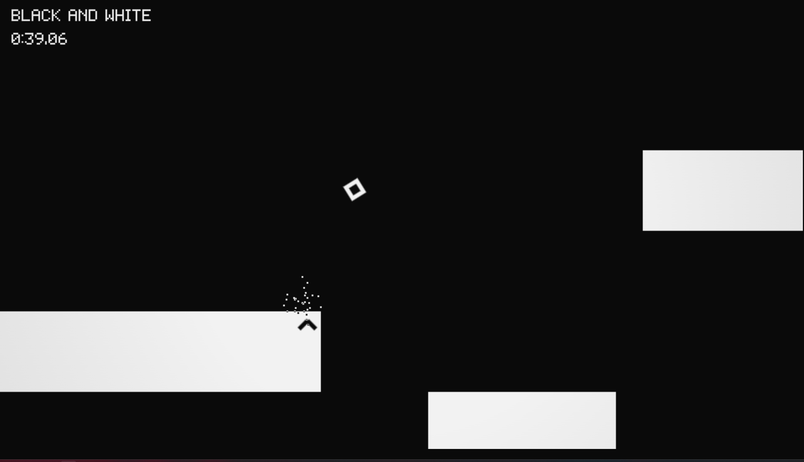

# it's never just black and white

**[▶ Play it in your browser — neverbnw.calcitedev.me](https://neverbnw.calcitedev.me)**

A minimalist momentum platformer built from scratch in **TypeScript on the Canvas API**, with **zero runtime dependencies**. You are a square. The world is two colours. Press space and both of them — along with gravity — turn inside out.

No third-party engine, framework, or asset pipeline: the physics is a hand-written rigid-body solver, the soundtrack is synthesised WebAudio, the font is a 5×7 bitmap, the art is two hex values, and the twenty campaign levels are JSON grids authored in an editor that ships inside the game.



> ⚠️ The game inverts the whole screen between black and white on a keypress, and shakes the view at speed. It warns you on the title screen; if you are photosensitive, please take that seriously.

## At a glance

| | |
| --- | --- |
| **Live** | [neverbnw.calcitedev.me](https://neverbnw.calcitedev.me) — no install, no login |
| **Stack** | TypeScript (strict), HTML5 Canvas 2D, WebAudio, Vite, Vitest |
| **Runtime dependencies** | 0 — dev deps are `typescript`, `vite`, `vitest` and nothing else |
| **Size** | ~226 kB bundle, **43 kB gzipped**, including all 20 levels |
| **Tests** | 813 unit tests across 29 files, headless node, ~1.4 s |
| **CI** | GitHub Actions: typecheck → test → build on every push and PR |
| **Source** | ~14,400 lines under `src/`, ~12,700 lines under `tests/` |
| **Content** | 20 hand-authored levels, plus an in-browser editor with import/export/share |

## Play

```bash
npm install && npm run dev
```

Then open http://localhost:5173 — or just use the [live build](https://neverbnw.calcitedev.me).

### Controls

| Action | Keys |
| --- | --- |
| Move | `A` / `D`, or `←` / `→` |
| Jump | `W`, `↑`, or `Z` |
| **Flip** — invert colours *and* gravity | `Space` |
| Restart level | `R` |
| Pause | `Esc` or `P` |
| Mute / Fullscreen | `M` / `F` |
| Level editor | `E` from the title screen or a level-select row |
| Custom levels | `C` from the level select, or its pinned first row |
| — on that screen | `Enter` play · `E` export · `D` edit · `X` delete |

There is no double jump. The flip is the air move — and **it only recharges when you touch ground**, so every gap is a jump, a flip, or a jump-then-flip. Reach the goal; the only hazard is leaving the world vertically, and since gravity flips, both directions are lethal. Levels also carry jump pads, which throw you along their facing, and a **flip recharge** pickup — the flip's own charge as a placeable object, which is how a level says "here, have a second one".

## Engineering highlights

These are the parts worth reading the code for.

**A rigid-body solver, written by hand.** The square carries angular velocity, its corners genuinely collide with the world through SAT, off-centre impacts spin it, and it can land tilted and settle. Nothing is animated — every frame you see is the simulation. But linear motion stays deliberately arcade: left and right set velocity directly, and the velocity component into a surface is clamped dead on contact, so spin supplies all the drama and never decides where you land. [docs/PHYSICS.md](docs/PHYSICS.md) has the impulse math and the one line that joins the two models.

**Determinism, enforced by test.** Fixed 60 Hz timestep, no wall-clock reads on a logic path, and all randomness routed through a seeded `Rng`. The same start state plus the same input sequence produces a bit-identical trajectory over hundreds of steps, and a test asserts it — so accidental non-determinism surfaces as an immediate red instead of a physics bug found three phases later.

**Logic never touches the DOM.** Physics, entities, level parsing, scenes and editor state import no browser APIs at all; only the bootstrap, renderer, audio, storage/clipboard IO and `Input.attach` may, and even those are importable in node. The whole suite therefore runs headless with no jsdom and no shim — 813 assertions in under two seconds. `Input.attach` owns the pointer and converts it to view space on the way in, which is why the editor can be unit-tested *with the mouse*: a test paints a stroke, undoes it, resizes the grid, playtests it, and never constructs a canvas.

**Two colours, enforced structurally.** `paper` and `ink`, and the flip swaps which hex each resolves to. No hex literal exists anywhere outside `engine/palette.ts`, so the flip is a single field assignment and no draw call ever branches on the current phase — particles composite an inversion of the frame rather than wearing a colour. That discipline is what lets the final level break the rule on purpose and have it land.

**One number drives the whole feel.** Normalised speed closes the vignette, splits the colour channels, bounces the screen, and gates four layers of synthesised techno. Because they share an input, they arrive together: the game visibly and audibly opens up as you get fast.

**The level editor is a scene, not a side tool.** `E` opens a picker — new level, import, every autosaved draft, every shipped level (which opens as a *copy* with an id of its own, because a level in `src/levels/` is a file under version control). It edits the level's *characters* rather than a parsed model, so validation, serialisation and playtesting are the same three functions the game already had, and playtest hands the grid straight to the real `PlayScene` — no second parser, no preview mode. Drafts autosave every stroke and show up under CUSTOM LEVELS ready to play with no import step; `Ctrl+S` exports `<id>.json` byte-identical to what `serializeLevel` writes, and dropping a `.json` on the window imports it — validated by the same function the editor's error panel uses, and renamed rather than overwritten on an id clash. The shipped campaign levels were built in it start to finish, without opening a text editor. That was the point.

**Assets are code.** Two hex values, a 5×7 bitmap font, oscillator envelopes and JSON grids. No binary game assets, which is how twenty levels of content fit in a 43 kB gzipped bundle that loads instantly on a cold cache.

## Development

```bash
npm run dev        # vite dev server on :5173
npm test           # vitest — 813 tests, node environment
npm run typecheck  # tsc --noEmit
npm run build      # typecheck + production build
```

CI runs typecheck, tests and the production build on every push and pull request — [.github/workflows/ci.yml](.github/workflows/ci.yml).

### Dev URL params

Each is read once in [src/main.ts](src/main.ts) and works on the dev server or a production build — append it to the page URL, e.g. `http://localhost:5173/?tune=1`.

| Param | What it does |
| --- | --- |
| `?editor=1` | Boots straight into the editor's picker instead of the title screen — new level, import, every draft, every shipped level. Skips the title/level-select walk when you are authoring. |
| `?tune=1` | Mounts the [dev tuner](src/devtuner.ts) over the canvas: live sliders for the wind-up escalation numbers and the whole lead-synth instrument, with AUDITION to force the bed to full intensity from any scene. Each section's COPY puts paste-ready `constants.ts` lines on the clipboard — the tuner writes to `engine/tuning.ts` and never edits the game. |
| `?perf=1` | Mounts the [performance monitor](src/devperf.ts) and turns the profiler on: per-phase frame timings in a panel, plus a `window.__perf` scripting API for recording a session. |

Both panels are dynamically imported behind their flag, so a player's bundle never contains them and the instrumentation in the loop costs one boolean test per frame when it is off. `window.__bw = { game }` exposes the live `Game` in every build — handy for `__bw.game.setScene(...)` from the console.

### Project structure

```
src/
  constants.ts     every tuning number, commented with units
  game.ts          fixed-timestep loop (60 Hz) + scene management
  main.ts          browser bootstrap (canvas, resize, fullscreen)
  engine/          rng, input, font, palette, renderer, audio, save,
                   particles, levelio, link, perf, tuning
  world/           tiles, obb, physics, level, camera
  entities/        player — the only entity
  scenes/          title, level select, play, results, credits, finale,
                   in-world signs, editor + its picker and controls panel,
                   custom levels, and the shared menu and tile drawing
  editor/          pure grid model, undo, validation, warnings, the draft
                   shelf, the zoom ladder
  levels/          20 hand-authored levels, one JSON file each
tests/             vitest, node environment — no DOM required
docs/              design doc, build plan, architecture and physics deep-dives
```

### Docs

- [docs/GAME-DESIGN.md](docs/GAME-DESIGN.md) — the design source of truth: palette, mechanics, tuning targets, level format, module contracts
- [docs/PHASES.md](docs/PHASES.md) — the seven-phase build plan, each phase's *as built* notes, and the post-0.2 amendments
- [docs/ARCHITECTURE.md](docs/ARCHITECTURE.md) — module graph, game loop, rendering pipeline, testing strategy
- [docs/PHYSICS.md](docs/PHYSICS.md) — the SAT rigid-body solver, the impulse math, and the numbers

## History

This repo used to hold **Pixel Quest**, a procedural dungeon platformer. Version 0.2 is a total rebuild from the game loop up, planned and executed in seven phases; nothing of the old build survives in `src/`, and it is preserved in git history before `d7a54ff`. All seven phases have landed, the twenty-level campaign and its colour ending have shipped, and the editor exists so that the work from here is levels.

## Author

Built by **CalciteDragon** — [calcitedev.me](https://calcitedev.me) · [Ko-fi](https://ko-fi.com/calcitedragon)

## License

This project is **source-available, not open source**. You may view and study the source, but reuse, modification, redistribution, incorporation into another project, and commercial use require prior written permission. See [LICENSE](LICENSE) for the full terms.
