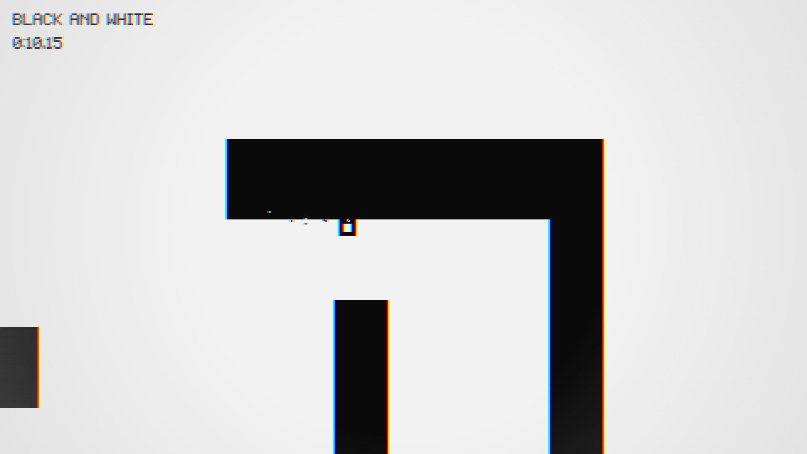

# it's never just black and white

A minimalist momentum platformer built from scratch with **TypeScript and the Canvas API**. You are a square. The world is two colours. Press space and both of them — along with gravity — turn inside out.

**Zero runtime dependencies**: every level is readable JSON, every sound is synthesised WebAudio, every pixel is drawn by hand from two hex values.



> **0.2, and the overhaul is done.** This is a total rebuild of Pixel Quest — the dungeon platformer this repo used to hold, preserved in git history before `d7a54ff` — remade from the loop up in seven phases. All seven have landed: the square is a real rigid body that tumbles and catches on corners and rights itself, the world inverts on a keypress, four layers of synthesised techno arrive as you get fast, and levels are drawn in a browser editor that writes JSON straight to disk. What is left is **levels**, which is the work the editor exists to enable. See [docs/PHASES.md](docs/PHASES.md) for the plan and everything that was learned building it.

## Play

```bash
npm install
npm run dev
```

Then open http://localhost:5173.

### Controls

| Action | Keys |
| --- | --- |
| Move | `A` / `D`, or `←` / `→` |
| Jump | `W`, `↑`, or `Z` |
| **Flip** — invert colours *and* gravity | `Space` |
| Restart level | `R` |
| Pause | `Esc` or `P` |
| Mute / Fullscreen | `M` / `F` |
| Level editor | `E` from the title screen or a level-select row |

There is no double jump. The flip is the air move — and **it only recharges when you touch ground**, so every gap is a jump, a flip, or a jump-then-flip.

### Rules

Reach the goal. The only hazard is leaving the world vertically, and since gravity flips, both directions are lethal. No enemies, no score, no lives. Death costs you about half a second. The one thing there is to collect is a **flip recharge** — the flip's own charge as a placeable object, which is how a level says "here, you get a second one"; it has no collision and comes back three seconds after it is taken.

## What makes it interesting

**The square is a real rigid body.** It carries angular velocity, its corners genuinely collide with geometry via SAT, off-centre impacts spin it, and it can land tilted and settle. Nothing is animated — every frame you see is the simulation.

But linear motion stays arcade: left and right set velocity directly, and the velocity component into a surface is clamped dead on contact. Spin supplies all the drama and none of the frustration, because it never decides where you land — only how you look getting there. [docs/PHYSICS.md](docs/PHYSICS.md) has the equations and the one line that joins the two models.

**Two colours, enforced structurally.** `paper` and `ink`, and the flip swaps which hex each resolves to. No hex literal exists anywhere outside `engine/palette.ts`, so the flip is a single field assignment and no draw call ever branches on phase. Colour survives in exactly three sanctioned places — particles, the vignette, and chromatic fringing at speed — which is what will make the final level's ending land.

**One number drives the whole feel.** Normalised speed closes the vignette, splits the colour channels, bounces the screen, and gates four layers of synthesised techno. They share an input, so they arrive together: the game visibly and audibly opens up as you get fast.

**Levels are drawn in the browser.** The editor is a scene inside the game, not a separate tool, and it edits the level's *characters* rather than a parsed model — so validation, saving and playtesting are the same three functions the game already had, and playtest hands the grid to the real `PlayScene` with no second parser and no preview mode. In dev it writes `src/levels/*.json` straight to disk through a Vite middleware; a production build has no such endpoint, so it falls back to localStorage and clipboard export — chosen by *trying* rather than by a build flag, so the fallback is not a branch nobody exercises until it ships.

The shipped `02-second-nature` was built in it, start to finish, without opening a text editor. That was the point.

**The editor unit-tests with the mouse.** A press arrives as `Input.onPointerDown(vx, vy, button)` in view space — `attach` runs the letterbox inverse on the way in — so the pure core never learns that a scale exists, and a test paints a stroke, undoes it, resizes the grid, playtests it and comes back with no canvas anywhere.

## Development

```bash
npm run dev
npm test
npm run typecheck
npm run build
```

### Project structure

```
src/
  constants.ts     every tuning number, commented with units
  game.ts          fixed-timestep loop (60 Hz) + scene management
  main.ts          browser bootstrap (canvas, resize, fullscreen)
  engine/          rng, input, font, palette, renderer, audio, save, particles, levelio
  world/           tiles, obb, physics, level, camera
  entities/        player
  scenes/          title, level select, play, results, editor, menu, tiledraw
  editor/          pure grid model, undo, validation, warnings
  levels/          hand-authored level JSON, one file per level
tests/             vitest, node environment — no DOM required
docs/              design doc, build plan, architecture and physics deep-dives
```

### Docs

- [docs/GAME-DESIGN.md](docs/GAME-DESIGN.md) — the design source of truth: palette, mechanics, tuning targets, level format, module contracts
- [docs/PHASES.md](docs/PHASES.md) — the seven-phase build plan and what's landed
- [docs/ARCHITECTURE.md](docs/ARCHITECTURE.md) — module graph, game loop, rendering pipeline, testing strategy
- [docs/PHYSICS.md](docs/PHYSICS.md) — the SAT rigid-body solver, the impulse math, and the numbers

### The three load-bearing decisions

1. **Logic never touches the DOM.** Physics, entities, level parsing, and editor state import no browser APIs, so the entire suite runs in plain node with no shim. A rigid-body solver with angular impulses has far more room for subtle error than an AABB sweep, and a few hundred headless assertions running in milliseconds is the only affordable way to pin it down.
2. **Determinism, re-pointed.** The old build needed it to reproduce a dungeon from a seed. This one needs it so that the same start state plus the same inputs produce a bit-identical trajectory over hundreds of steps — which a test asserts, turning any accidental non-determinism into an immediate red rather than a physics bug found three phases later.
3. **Assets are code.** Two hex values, a 5×7 bitmap font, oscillator envelopes, and JSON grids. No binary game assets, and the production build is a single small bundle.

## License

[MIT](LICENSE)
