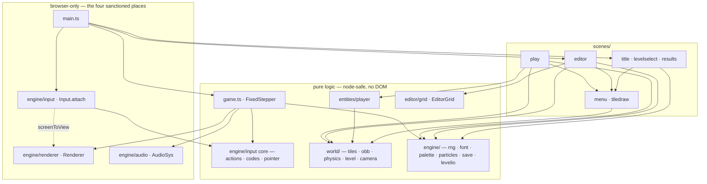

# Architecture

How *it's never just black and white* is put together, and why it tests so easily.

> **Status:** as-built. Every module, export, key and constant named below exists in `src/`, and every measurement was taken against this code. The design it is built against is [GAME-DESIGN.md](GAME-DESIGN.md); the plan that got here, and the history, are [PHASES.md](PHASES.md).

## Layering



**The rule that holds it together**, inherited unchanged from the old build: game logic never touches `document`, `window`, canvas or `AudioContext` — not at import time, and not on a logic path. Exactly four places may reach a browser API at runtime: `main.ts`, `Renderer`, `AudioSys` (lazily, guarded) and `Input.attach`. Everything else runs under vitest's node environment with no DOM shim, which is what makes 517 tests cost under a second.

Phase 7 put that rule under the only real pressure it has had, because an editor is a mouse. The resolution is that **`Input.attach` owns the pointer, and converts to view space on the way in.** `screenToView(canvasW, canvasH, clientX, clientY)` — the exact inverse of `present()`'s integer-scaled letterboxed blit — sits in `renderer.ts` beside `computeScale`, is pure, and reports an `inFrame` flag rather than clamping. `Input`'s core then takes `onPointerDown/Move/Up(vx, vy, button)` already in view coordinates and never learns that a scale exists. There is therefore exactly one place in the project where the letterbox arithmetic lives, and exactly one place it can be wrong — and `EditorScene` unit-tests headlessly *with the mouse included*: a test paints a stroke, undoes it, resizes the grid, playtests it and comes back, and there is no canvas anywhere.

Getting that wrong is not a sub-pixel error. At a 1920×1000 window `computeScale` gives scale 1, `offX` 480, `offY` 230, so a naive `clientX / scale` lands 480 px right and 230 px down — fifteen tiles across on a 32 px grid, which reads as "the editor feels off" rather than as arithmetic. The round-trip test picks window sizes that deliberately do not fit exactly.

That conversion is also why `engine/input.ts` imports from `engine/renderer.ts` — the one edge in the diagram running from the pure tier into the browser tier. It imports a pure function *out* of a browser-facing module, not a browser API: `renderer.ts` executes nothing at import time, and `Renderer`'s constructor is the only part of it that needs a canvas.

**`Input` is three layers, not one.** Actions are the game's twelve verbs and `BINDINGS` pins them; `PlayScene` reads nothing else. Raw codes are every `KeyboardEvent.code`, recorded whether or not it is bound and exposed as `codeDown` / `codePressed` / `pressedCodes` / `shiftDown` / `ctrlDown`, because the editor needs `Digit1`–`Digit8` for its palette, `ShiftLeft` for flood-fill and letters for its id field — and none of those is a game verb. "Paint" must not become an `Action`: GAME-DESIGN §12 pins that list. The raw layer also settles `Space`, which is bound to *both* `flip` and `confirm`; the editor's space-drag pan reads the code and neither action. The pointer is the third layer, with `down`/`pressed`/`released` edges per button cleared by the same `update()` that clears the keys.

Two modules are worth naming for where they are *not*. `editor/grid.ts` imports nothing but `constants.ts` — no tilemap, no renderer, no DOM — so the editor's model is as testable as the solver. And `scenes/tiledraw.ts` is shared by `PlayScene` and `EditorScene`, which is what stops the pad chevron existing twice with two things to retune the next time `PAD_CHEVRON_WIDTH` moves.

The rule earns more now than it did before the overhaul, not less. A rigid-body solver with angular impulses has far more room for subtle error than an AABB sweep, and the only affordable way to pin it down is a few hundred headless assertions running in milliseconds.

## The loop

`Game.start()` runs a requestAnimationFrame loop feeding `FixedStepper`, a pure accumulator: wall-clock time in, zero-or-more callbacks of exactly `STEP = 1/60 s` out, remainder carried, long frames clamped to 250 ms so a background tab never triggers a catch-up spiral. Scenes implement `update(dt, game)` / `render(r, game)`; rendering happens once per animation frame after all fixed steps.

The fixed step is load-bearing for correctness, not just consistency — variable-dt rigid-body integration would make the physics non-reproducible and the determinism test meaningless.

Input edge state (`pressed`/`released`) clears **after each consumed fixed step**, not per animation frame — a two-step frame must not double-fire a menu move, and a zero-step frame must not drop a press before any step saw it. This matters more than it used to: dropping a flip press is a death.

`Game.stepFrame(elapsed)` exposes one full frame cycle publicly, so automation can drive the game deterministically through `window.__bw.game.stepFrame(...)` even in a hidden tab where RAF is suspended.

## Rendering pipeline

Everything draws into an offscreen **960×540** canvas, then `present()` blits it to the visible canvas at the largest integer scale that fits, centred with letterbox bars.

The significant break from the old build is that shapes are **antialiased**: a square resting at 37° needs a clean edge, and the vignette needs a smooth gradient. Integer scaling survives only to keep the post-processing costs predictable and the bitmap font crisp.

What delivers that is the **coordinate policy**, not `imageSmoothingEnabled` — Canvas 2D antialiases `fillRect` and paths unconditionally, and the flag only affects `drawImage` and pattern scaling. The old build's crispness came from rounding every draw to whole pixels, so antialiasing is a question of where that rounding survives:

| Path | Rounds? | Why |
| --- | --- | --- |
| `setCamera` | yes | Tile coords are multiples of 32; a whole-pixel camera keeps static geometry crisp and stops seams appearing between adjacent runs. |
| `rect`, `rectRotated`, `rectRotatedOutline` | no | Sub-pixel positioning is the whole point — this is what antialiases a rotated body. |
| `text`, `textCentered` | yes | The 5×7 bitmap font is the one deliberately low-res element (GAME-DESIGN §2). Blurring it throws away the signature. |
| `ParticleSystem.render` | yes | A spark is 1–3 px, and sub-pixel placement spreads a 2 px square into a dim 3×3 smear — on the only saturated colour in the game, whose whole job is to read as an event. A sanctioned exception, not an oversight. |
| `present` | n/a — `imageSmoothingEnabled = false` | Smoothing an integer-scaled blit would soften the entire frame. The only place softness is wanted is inside `applyPost`, and the offscreen buffer sets the flag **on** for exactly that reason: the aberration pass blits it at sub-pixel offsets. |

`PlayScene`'s draw order per frame:

1. Clear to `paper`.
2. World geometry in `ink`, camera-translated, through `drawTileRuns` — per-row run merging, so a 40-tile floor is one `fillRect`.
3. The goal outline, then the player as a rotated rect plus its `paper` core.
4. Particles (the only accent-coloured pass).
5. HUD in `ink`, untranslated.
6. `applyPost(speedNorm)` — vignette always, chromatic aberration only above `CA_THRESHOLD`.
7. The death fade, and the pause overlay if it is up — **after** the post pass, so a frozen menu is crisp rather than wearing the aberration of whatever speed the frame was carrying.

The two veils are opposite colours on purpose. Death fades to `ink`; the pause dims with `paper` at `PAUSE_DIM`, because it is the background flooding back in and the menu then reads in `ink` like text on every other screen. `ink` there would be exactly backwards — in phase A ink is near-white, so the dim would wash a black frame to grey and leave the white geometry indistinguishable from it.

The particle pass also assigns `fillStyle` exactly **once** per frame and then issues N `fillRect`s, because particles store no colour of their own — they read the live accent. That is why a flip inverts every spark already in the air, including the flip's own ring.

### Colour

No hex literal appears anywhere except `engine/palette.ts`. Drawing code asks for `paper`, `ink`, or `accent` and the palette resolves it against the current phase. The flip is therefore a single field assignment, and any `if (phase === …)` inside a draw call is a bug — it means a colour has escaped the palette.

## Physics

Full treatment in [PHYSICS.md](PHYSICS.md). Architecturally, it's a two-layer split:

- **`world/obb.ts`** — pure oriented-box geometry with no knowledge of tilemaps, gravity, or the player. SAT, projections, contact points. This is the layer that gets hammered with unit tests, because it's where a sign error would poison everything above it.
- **`world/physics.ts`** — integration, broadphase against the `TileMap`, resolution order, impulse response, grounded detection, damping and the auto-right spring.

Linear motion is arcade (velocity set directly by input); angular motion is simulated. That split lives in the boundary between `entities/player.ts` (which owns linear intent) and `world/physics.ts` (which owns everything rotational).

## Audio

Two halves in one module, split on exactly the line `renderer.ts` splits `vignetteAlpha` from `applyPost`.

The **upper half is pure**: a beat grid, four literal pattern tables, and `scheduleWindow(state, now, intensity, out)`, which advances the layer cross-fades, resyncs the cursor if it fell behind, and fills a caller-supplied buffer with the notes starting inside the lookahead window. It is arithmetic, it is node-safe, and it is unit-tested against hand-computed times.

The **lower half is nodes**: `AudioSys` takes an injected context factory — defaulting to a guarded `new AudioContext()` — so the tests drive the real class through a ~90-line fake and count every source created against every `stop` scheduled. "The module imports without throwing under node" was the old test, and it was worth almost nothing.

```
destination ◀── master ◀┬── music ◀── layer gains (kick·hats·bass·arp)
                        ├── per-voice envelopes (SFX, dry)
                        └── lowpass ◀── delay ◀── send ◀── per-voice taps + arp
                                └───── feedback ─────┘
```

One shared feedback-delay send gives every effect the same room instead of nine effects each with their own, and its feedback rises with `speedNorm`. The lowpass sits *inside* the loop, so successive repeats darken rather than merely quieten.

Three rules the module is built on:

- **No source is ever created without a scheduled `stop`.** WebAudio node lifetime is the classic leak here and it degrades slowly enough to ship; one node-making path with one rule is the mitigation, and a unit test counts the balance. Measured over 16 s of real play: 492 started, 492 stopped, 0 live.
- **A stalled scheduler resyncs, it does not catch up.** See GAME-DESIGN §9 — this is the difference between a gap and a bar of notes fired into one instant.
- **Nothing in the simulation may ever read the music clock.** The scheduler reads `AudioContext.currentTime`, which is legitimate for the same reason `dateIso` is on the persistence path: it is not a logic path. A "sync the jump to the beat" idea would break determinism outright.

`setIntensity(speedNorm)` is the pump as well as the target-setter, called **exactly once per frame** by `PlayScene` — the only scene that has a bed at all, started in `enter` and stopped in `exit`. It is fed **0** rather than `speedNorm` while dying, won or paused, so death, the goal and the pause menu are all punctuated by the bed dropping out. Once-per-frame is an assertion, not a habit: it is the one observable that separates a real freeze from a `dt = 0` one (see [PHYSICS.md](PHYSICS.md) § Determinism), so the pause test counts the entries rather than trusting the shape of the code.

Every other scene is silent but for its menu blips. A techno bed under a motionless title screen spends the escalation before the player has done anything to earn it, and under an editor it would be scored to the wrong activity entirely.

## Scenes and flow

```
Title ─┬─▶ Play(campaign i) ─▶ Results ─┬─▶ Play(campaign i+1)
       │        ▲                       ├─▶ Play(campaign i)      (retry)
       │        │                       └─▶ Level select
       ├─▶ Level select ────────────────────▶ Play(campaign i)
       │        └── E on a row ─▶ Editor
       └─▶ Editor ⇄ Play(playtest)
```

**`PlayContext` is what makes the two arrows out of `PlayScene` different**, and it decides three things at once — where a win goes, whether `bw.progress` advances, and whether a best time is written at all:

```ts
type PlayContext =
  | { readonly kind: 'campaign'; readonly index: number }
  | { readonly kind: 'playtest'; readonly back: Scene };
```

Before it existed, `index` defaulted to 0, so a level that is not in `LEVELS` — exactly what the editor's playtest hands over — advanced into `LEVELS[1]` on completion. The honest fix is not a better default; it is to stop defaulting. And the bug under that bug was the save: a draft carrying the id of a shipped level would otherwise overwrite `bw.best.01-first-steps` with a time set on a grid that exists only in someone's browser. **A playtest writes nothing** — no best time, no progress — and on either a win or a quit it returns to the editor *instance* it came from, so the grid, the undo stack and the view all survive because the scene does. That is GAME-DESIGN §10's "returns with edits intact" stated as an object identity rather than as a serialisation round-trip.

`PlayScene` owns the level lifecycle — spawn, death and respawn fades, goal detection, pause, the timer — and delegates the numbers to `constants.ts`, where every tuning value lives with its unit. Tests assert derived properties of those numbers, so retuning that breaks level geometry fails CI rather than shipping.

**The pause is a freeze, not a slow step.** `update` returns early, so no smoother, camera, particle or solver takes a step and the resumed trajectory is bit-identical to the uninterrupted one. The timer is unaffected for free — it only ever advances in `running`.

**`Esc` means four different things, and exactly one reader in each scene may see it.** `back` and `pause` are bound to the same two keys, so `PlayScene` reads `pause` and nothing else: a scene reading both would fire twice on one keypress, and the reader this replaced quit to the title mid-run, silently discarding the attempt. The editor reads `back` to leave — except in text-entry mode, which is checked first and swallows every key including that one.

The four vertical menus are one function. `updateMenu(game, index, count)` in `scenes/menu.ts` reads `up`/`down`/`confirm`, wraps at both ends, plays `menuMove` and `menuPick`, and returns `{ index, picked }`; the title, the level select, the results screen and the pause overlay each own only their item list and their switch. Four copies of "up, down, wrap, blip, confirm" would be four places for the wrap to be off by one and four places to forget the blip.

Every shell scene calls `palette.reset()` in `enter`. The palette is the only readout of gravity there is (GAME-DESIGN §2) and a menu has no gravity, so a screen that inherited the phase from however the last run happened to end would be showing a readout of nothing — and would look different on every visit.

The title's controls footer is built from `BINDINGS` through `bindingLabel`, not from a hardcoded string, so a rebinding cannot leave the front door of the game lying about which key does what. `fullscreen` is in that table for the label alone — no scene reads the action, because the toggle is pure browser chrome and lives on a raw keydown listener in `main.ts`. A verb the player is told about has to come from the same table as the verbs the player presses, or the footer is a second source of truth pretending to be a view of the first.

## The editor

`EditorScene` is the deliverable that outlives the phase that built it: everything after 0.2 is levels, and levels are made here or they are not made at all. It is also the first scene in the project with **modal state** — a text field that swallows every key, a pan that owns the mouse, a stroke in progress — so `mode` is a single explicit field of type `'paint' | 'id' | 'name'`, it is checked before anything else in `update`, and it is printed on screen. Mode bugs are the ones that survive a browser pass, because the tester knows which mode they are in.

**The grid model edits characters, not tiles.** `editor/grid.ts` holds a `readonly string[]` — GAME-DESIGN §8's own on-disk shape. The obvious model is a `TileMap` plus a spawn and a goal beside it, and it is wrong for one reason: `S` and `G` are metadata on an empty cell in a `Level`, but they are *paintable cells* in an editor, and a `TileMap` cannot hold them. Characters make `world/level.ts` the editor's entire format layer:

| The editor's operation | is |
| --- | --- |
| validate | `validateLevel(rows)` verbatim — the same function `src/levels/index.ts` runs at load |
| save | `buildLevelPayload`, byte-identical to `serializeLevel`, so what the editor writes is what `git diff` shows |
| playtest | `parseLevel({ id, name, rows })`, handing the real `PlayScene` a real `Level` — no second parser, no preview mode |
| open a shipped level | `editorInitFromLevel`, over `levelRows(level)` — `parseLevel`'s inverse, factored out of `serializeLevel` |

Two more things fall out for free: a resize from the left or the top moves the spawn and the goal, because they are characters in the rows being shifted, where a `TileMap` model would carry two coordinate pairs to fix up by hand at every edge; and an undo snapshot is a `string[]` copy, 1200 characters at 60×20. Undo is scoped to the **stroke** — the snapshot is pushed on pointer-down, so one `Ctrl+Z` reverts a whole drag however many frames it spanned, a stroke that changed nothing pushes nothing, and any new edit clears the redo stack.

The resize comes in two forms over one implementation. `resize(edge, delta)` nudges a named edge; `setSize(w, h)` states a destination and is the delta form twice under a single `atomic`, so growing wider and shorter at once is one undo step rather than two, and both go through the same `moveEdge` so they cannot disagree about which end characters come off. `parseSizeInput` turns the editor's typed `W X H` into a pair — pure, and here rather than in the scene, so the size field owns no parsing of its own. Clamping is `setSize`'s job and not the parser's: `999X999` parses and then lands on `EDITOR_MAX_W`/`EDITOR_MAX_H`, which beats rejecting the entry.

The model also makes two edits **unrepresentable**, which is worth more than any validation panel: painting `S` *moves* the spawn rather than adding a second one (same for `G`, and neither can be erased, only relocated), and a rectangular array of equal-length rows cannot go ragged. Between those and a fixed eight-character palette — `. # ^ v < > S G`, the tile enum plus the two markers — every error `validateLevel` can report is unreachable from this module except one: a resize that crops a marker off the grid. That is not an argument for dropping the panel; it is the argument for what the panel is *for*.

**Warnings belong to the editor, errors belong to `level.ts`.** `gridWarnings(rows)` is pure and separate, and covers the legal-but-probably-wrong: a pad facing into blocking geometry, a marker inside a solid tile, a marker on the top or bottom row where the death planes are. These cannot be errors — the grids are well-formed, `parseLevel` must accept them, and `src/levels/index.ts` throws on anything `validateLevel` rejects, so promoting a level-design footgun to a format error would turn a shipped level into a build failure. The panel lists both; only errors block a save.

**The save transport is behaviour-detected, not build-flag gated.** `saveLevel` in `engine/levelio.ts` attempts `POST /__level`, and falls back to localStorage plus the clipboard on any non-200, network failure or absent `fetch`, resolving to a `SaveOutcome` that names which route it took so the status line can say so. It never rejects: a save that throws mid-session is a save that loses work. `import.meta.env.DEV` would have worked and is the wrong shape — it makes the fallback, the branch that only ever runs in a production build, the branch nobody exercises until it ships. As written, `vite preview` and a real build take the same path they will in production, and so does a dev server the moment the plugin is missing.

Drawing the grid is the editor's one performance question, and it was answered the way the brief predicted it might have to be. One `fillRect` per cell — 2040 visible at half zoom — was budgeted at 0.31 ms from phase 6's measured fill rate and **measured at 1.11 ms** on a 200×60 grid of solid, 3.6× over, because that rate came from 2 px particles and these are 16 px cells: the draw is fill-rate bound rather than call bound. `forEachCharRun` merges runs across the character rows, so a solid 60-wide row is one rect instead of sixty and the same worst case measures **0.06 ms**. Merging over `readonly string[]` rather than a rebuilt `TileMap` is what keeps `S` and `G` drawable and avoids rebuilding anything on every stroke.

The two zoom steps are 32 px and 16 px, both integer, and `½` is not one option among many: 60 tiles × 16 px = 960 px = `VIEW_W` exactly, so half zoom is precisely one screen per sixty tiles. A continuous or cursor-anchored zoom would buy nothing over that and cost fractional tile geometry and seams at every non-integer scale — the exact problem the coordinate policy above was written to avoid.

## Persistence

`SaveStore` wraps an injectable `StorageLike` — localStorage when available, an in-memory `Map` otherwise — with every access in a try/catch, because storage can be absent (node), throw on the property access itself (a sandboxed iframe) or throw on write (private mode, quota). The surface is four keys under the `bw.` prefix, and **all four now have a writer**, which is the first time that has been true:

| Key | Written by | Read by |
| --- | --- | --- |
| `bw.progress` | `PlayScene.win`, campaign only, `setProgress(index + 1)` | the title's PLAY (continue where you got to), the level select's lock |
| `bw.best.<levelId>` | `PlayScene.win`, campaign only, `submit` | the level select's per-row time, the results screen's previous best |
| `bw.muted` | `Game.toggleMute` | `Game`'s constructor, once |
| `bw.editor.draft` | `EditorScene` on every stroke end, and `saveLevel`'s fallback | `draftFromSave`, entering the editor from the title or from `?editor=1` |

`setProgress` is **monotone** — `max(stored, n)` — because completing an early level again must not re-lock the later ones, and a player who replays level 1 for a better time would otherwise find the rest of the game gone. `getProgress` reads anything missing, corrupt, negative or non-finite as **0**, which unlocks exactly the first level: not none, which would lock a player out of their own game, and not all of them, which would make the key pointless.

Best times are times — lower wins, and `submit` persists only on a strict improvement, so a tie leaves the stored date alone. `getText`/`setText` sit beside `getBest`/`submit` because the editor's draft is JSON the editor itself owns: running `getBest`'s shape check over it would be the wrong check applied to the wrong shape, and a `SaveStore` that knew what a level grid was would be a layering violation for no gain.

A serialised 60×20 level is about 1.3 KB, so autosaving the draft on every stroke end costs 0.03 % of a 5 MB quota — which is why a reload never loses more than the stroke in progress.

## Determinism

One seeded mulberry32 `Rng` still serves all randomness, but its job has changed. With procedural generation gone, determinism is no longer about reproducing a dungeon from a seed — it's about the **physics being reproducible**: same start state plus same input sequence must produce a bit-identical trajectory over hundreds of steps, and a test asserts exactly that.

Cosmetic randomness (particle jitter) uses separate fixed-seed `Rng` instances so visual variation can never perturb the simulation. `Math.random` appears nowhere in logic.

## Testing

**21 test files, 517 tests, node environment, no DOM shim, under a second.** The suite is the direct dividend of the layering rule: there is no jsdom, no canvas shim and no browser in it, and there never has been.

`tests/harness.ts` holds `fakeGame()` — a ~20-line object literal cast through `unknown` to `Game`, carrying a real `Input`, a real `SaveStore` over an inspectable in-memory `StorageLike`, and a `SpyAudio` that *extends* the real `AudioSys` with a context factory returning null. Driving the real class matters: the bed's lifecycle and the intensity ducking are assertions about what a scene calls, and a hand-written stub would happily let a scene call something the class does not have. `setScene` records rather than enters, so a test can assert where a scene went without running what it went to.

Input goes in at the bottom of the stack rather than being simulated above it. Keys arrive as real `KeyboardEvent.code` strings through `Input.onKey`, so the binding table is on the tested path; the mouse arrives as view-space coordinates through `Input.onPointerDown(vx, vy, button)`, so the pointer core is too, and `screenToView` is round-trip tested separately against window sizes that do not divide evenly. The result is that the editor — a mouse-driven tool — is tested exactly like everything else.

## Dev tooling

- `vite.config.ts` ships two dev-only middlewares. `POST /__shot?file=…` writes a base64 PNG to disk, so a workflow can capture real gameplay straight from the canvas. `POST /__level?id=<id>` writes `src/levels/<id>.json`, so a level drawn in the browser becomes a committable file without anyone opening a text editor.
- The two differ in one respect and that is the point: the screenshot sink takes a **path** from the caller and then tries to prove it safe, which is a denylist over path syntax — the family of check that keeps being wrong (backslashes, unicode normalisation, percent re-decoding, an absolute path that never contains `..` at all). The level sink takes an **id**, admits it only against `^[a-z0-9][a-z0-9-]*$` — a charset that cannot express a separator — and builds the path itself. There is no traversal to detect because there is no caller-supplied path. That regex is duplicated from `LEVEL_ID_PATTERN` in `engine/levelio.ts` on purpose: a vite config must not import from `src/`, and a third module existing solely to be shared between a browser bundle and a node config would be worse than two lines kept in step.
- The level sink deliberately does **not** touch `src/levels/index.ts`. A middleware rewriting a TypeScript source file to add an import is codegen, in a dev server, against a file under version control; the honest alternative is a one-line manual edit, and the save's on-screen confirmation names it.
- Neither middleware exists in a production build, which is exactly what makes `saveLevel`'s localStorage-plus-clipboard fallback a live path rather than dead code.
- `window.__bw` exposes the `Game` for deterministic frame-driving from the console or automation, and `?editor=1` boots straight into the editor, onto the autosaved draft if there is one.
- `.claude/launch.json` describes the dev server for tooling; CI (`.github/workflows/ci.yml`) runs typecheck, tests, and the production build.
