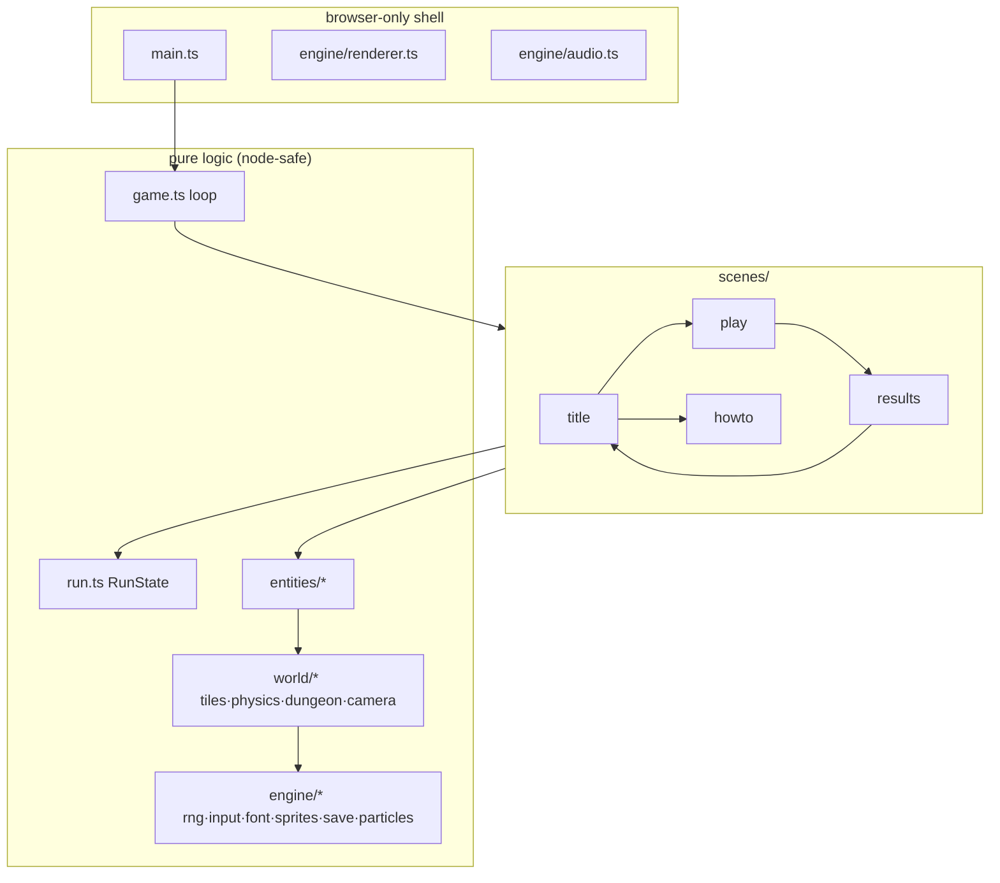

# Architecture

How Pixel Quest is put together, and why it tests so easily.

## Layering



**The rule that holds it together:** game logic never touches `document`, `window`, canvas, or `AudioContext` at import time or on logic paths. Only four places may reach browser APIs at runtime — `main.ts`, `Renderer`, `AudioSys` (lazily, guarded), and `Input.attach`. Everything else runs unchanged under vitest's node environment. That is why the suite (18 files / 145 tests) needs no DOM shim, and why a real `PlayScene` can be bot-driven headlessly in a test.

## The loop

`Game.start()` runs a requestAnimationFrame loop feeding `FixedStepper`, a pure accumulator: wall-clock time in, zero-or-more callbacks of exactly `STEP = 1/60 s` out, remainder carried, long frames clamped to 250 ms so a background tab never triggers a catch-up spiral. Scenes implement `update(dt, game)` / `render(r, game)`; rendering happens once per animation frame after all fixed steps.

Input edge state (`pressed`/`released`) clears **after each consumed fixed step**, not per animation frame — a two-step frame must not double-fire a menu move, and a zero-step frame must not drop a press before any step saw it.

`Game.stepFrame(elapsed)` exposes one full frame cycle publicly. The RAF loop calls it, and automation can call it directly — browsers suspend RAF entirely in hidden tabs, so the dev hook `window.__pq.game.stepFrame(...)` is how CI-style browser checks drive the game deterministically.

## Rendering pipeline

Everything draws into an offscreen 480×270 canvas (`imageSmoothingEnabled = false`), then `present()` blits it to the visible canvas at the largest integer scale that fits, centered with letterbox bars. Draw calls snap to integer pixels; the camera applies as a translation inside `Renderer` (`ui: true` skips it for HUD work).

Sprites are authored as string grids (one char = one palette entry, 14 colors total) in `engine/sprites.ts`, decoded to index arrays (pure, tested), and rasterized once per session into canvas caches — plus a mirrored cache for cheap horizontal flips. Text is a 5×7 bitmap font drawn as fill-rects. Tiles render procedurally: slate fill, cyan lit top edges, positional-hash texture flecks — no tile art assets.

## State & flow

```
TitleScene ──1P/2P/Daily──▶ PlayScene ──run ends──▶ ResultsScene ─▶ (retry/new/title)
     └───────How to Play──▶ HowToScene ──▶ TitleScene
```

`PlayScene` owns entities and cross-entity rules (stomp vs. contact damage, spikes, pits, the door, co-op respawn timing) but delegates every number that matters to two pure modules:

- **`run.ts` (`RunState`)** — score, level progression, victory/game-over, the localStorage key for the mode. Fully unit-tested; the scene is a shell around it.
- **`constants.ts`** — every tuning value in the game, with units. Tests assert derived properties of these numbers (see [PHYSICS.md](PHYSICS.md)), so retuning that breaks a design target fails CI rather than shipping.

Entities receive an `EntityWorld` context (`map`, `particles`, `rng`, `sfx()`, `shake()`) instead of reaching for globals — tests inject fakes trivially, and entities stay canvas-free (each has a small `render(r)` that only the browser path calls).

## Persistence

`SaveStore` wraps an injectable `StorageLike` (localStorage when available, in-memory fallback otherwise; every access try/caught). Keys: `pq.best.adventure`, `pq.best.coop`, `pq.daily.<YYYY-MM-DD>`, `pq.muted`. "Better" = higher score, ties broken by faster time.

## Determinism

One seeded mulberry32 `Rng` class serves all gameplay randomness. A run seed mixes with the level index (`mixSeeds`) to seed each dungeon; the daily seed is `hash('PIXEL-QUEST-DAILY-' + UTC date)`. Cosmetic effects (particles, patrol facing phases) use separate fixed-seed Rng instances so visual jitter can never desync gameplay. `Math.random` appears nowhere in logic.

## Dev tooling

- `vite.config.ts` ships a dev-only middleware (`POST /__shot?file=…`) that writes a base64 PNG body to disk — the canvas can screenshot itself for docs and automated visual checks.
- `window.__pq` exposes the `Game` for deterministic frame-driving from the console or automation.
- `.claude/launch.json` describes the dev server for tooling; CI (`.github/workflows/ci.yml`) runs typecheck, tests, and the production build.
