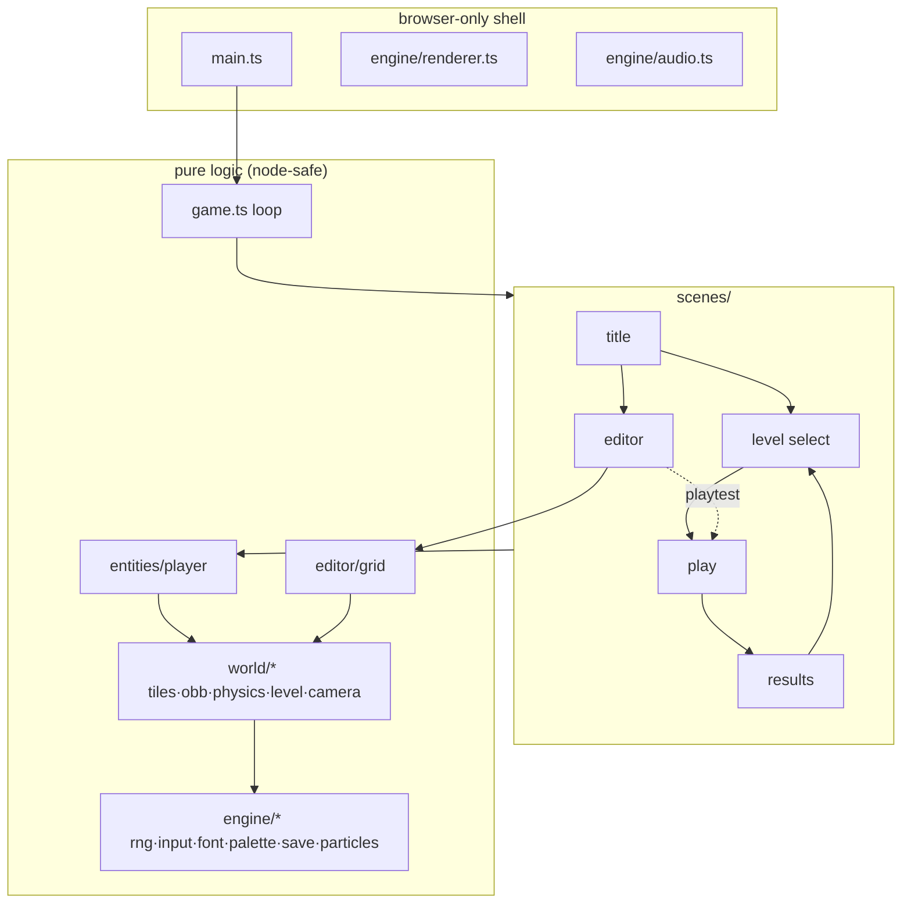

# Architecture

How *it's never just black and white* is put together, and why it tests so easily.

> **Status:** describes the target architecture from [GAME-DESIGN.md](GAME-DESIGN.md). Phases 2–7 land it; see [PHASES.md](PHASES.md). This document is refreshed from as-built code at the end of phase 7.

## Layering



**The rule that holds it together**, inherited unchanged from the old build: game logic never touches `document`, `window`, canvas, or `AudioContext` at import time or on logic paths. Only four places may reach browser APIs at runtime — `main.ts`, `Renderer`, `AudioSys` (lazily, guarded), and `Input.attach`. Everything else runs under vitest's node environment with no DOM shim.

The overhaul makes this rule *more* valuable, not less. A rigid-body solver with angular impulses has far more room for subtle error than an AABB sweep, and the only affordable way to pin it down is a few hundred headless assertions running in milliseconds.

## The loop

`Game.start()` runs a requestAnimationFrame loop feeding `FixedStepper`, a pure accumulator: wall-clock time in, zero-or-more callbacks of exactly `STEP = 1/60 s` out, remainder carried, long frames clamped to 250 ms so a background tab never triggers a catch-up spiral. Scenes implement `update(dt, game)` / `render(r, game)`; rendering happens once per animation frame after all fixed steps.

The fixed step is now load-bearing for correctness, not just consistency — variable-dt rigid-body integration would make the physics non-reproducible and the determinism test meaningless.

Input edge state (`pressed`/`released`) clears **after each consumed fixed step**, not per animation frame — a two-step frame must not double-fire a menu move, and a zero-step frame must not drop a press before any step saw it. This matters more than it used to: dropping a flip press is a death.

`Game.stepFrame(elapsed)` exposes one full frame cycle publicly, so automation can drive the game deterministically through `window.__bw.game.stepFrame(...)` even in a hidden tab where RAF is suspended.

## Rendering pipeline

Everything draws into an offscreen **960×540** canvas, then `present()` blits it to the visible canvas at the largest integer scale that fits, centred with letterbox bars.

The significant break from the old build: `imageSmoothingEnabled` is **on** and shapes are antialiased. A square resting at 37° needs a clean edge, and the vignette needs a smooth gradient. Integer scaling survives only to keep the post-processing costs predictable and the bitmap font crisp.

Draw order per frame:

1. Clear to `paper`.
2. World geometry in `ink`, camera-translated, with per-row run merging so a 40-tile floor is one `fillRect`.
3. Entities — the player as a rotated rect plus its `paper` core.
4. Particles (the only accent-coloured pass).
5. UI in `ink`, untranslated.
6. `applyPost(speedNorm)` — vignette always, chromatic aberration only above `CA_THRESHOLD`.

### Colour

No hex literal appears anywhere except `engine/palette.ts`. Drawing code asks for `paper`, `ink`, or `accent` and the palette resolves it against the current phase. The flip is therefore a single field assignment, and any `if (phase === …)` inside a draw call is a bug — it means a colour has escaped the palette.

## Physics

Full treatment in [PHYSICS.md](PHYSICS.md). Architecturally, it's a two-layer split:

- **`world/obb.ts`** — pure oriented-box geometry with no knowledge of tilemaps, gravity, or the player. SAT, projections, contact points. This is the layer that gets hammered with unit tests, because it's where a sign error would poison everything above it.
- **`world/physics.ts`** — integration, broadphase against the `TileMap`, resolution order, impulse response, grounded detection, damping and the auto-right spring.

Linear motion is arcade (velocity set directly by input); angular motion is simulated. That split lives in the boundary between `entities/player.ts` (which owns linear intent) and `world/physics.ts` (which owns everything rotational).

## State & flow

```
TitleScene ─▶ LevelSelectScene ─▶ PlayScene ─▶ ResultsScene ─▶ LevelSelectScene
     └──────▶ EditorScene ⇄ PlayScene (playtest)
```

`PlayScene` owns the level lifecycle — spawn, death and respawn fades, goal detection, the timer — and delegates the numbers to `constants.ts`, where every tuning value lives with its unit. Tests assert derived properties of those numbers, so retuning that breaks level geometry fails CI rather than shipping.

The editor's playtest path reuses the real `PlayScene` against an in-memory level rather than a preview mode, so what you test is what ships.

## Persistence

`SaveStore` wraps an injectable `StorageLike` (localStorage when available, in-memory fallback otherwise; every access try/caught). Keys use the `bw.` prefix: `bw.progress`, `bw.best.<levelId>`, `bw.muted`, `bw.editor.draft`. Best times are times — lower wins.

## Determinism

One seeded mulberry32 `Rng` still serves all randomness, but its job has changed. With procedural generation gone, determinism is no longer about reproducing a dungeon from a seed — it's about the **physics being reproducible**: same start state plus same input sequence must produce a bit-identical trajectory over hundreds of steps, and a test asserts exactly that.

Cosmetic randomness (particle jitter) uses separate fixed-seed `Rng` instances so visual variation can never perturb the simulation. `Math.random` appears nowhere in logic.

## Dev tooling

- `vite.config.ts` ships dev-only middleware: `POST /__shot?file=…` writes a base64 PNG to disk (canvas self-screenshotting for docs), and `POST /__level` writes `src/levels/<id>.json` so the in-browser editor saves straight into the repo. Neither exists in a production build; the editor falls back to localStorage and clipboard export there.
- `window.__bw` exposes the `Game` for deterministic frame-driving from the console or automation.
- `.claude/launch.json` describes the dev server for tooling; CI (`.github/workflows/ci.yml`) runs typecheck, tests, and the production build.
